# m5 prog

# Opdracht 1 Functions, Methods, Parameters & return type
Ik heb ervoor gezorgt dat er allemaal ballen komen.

https://github.com/ApollyonLeyssius/m5-prog/blob/main/m5%20prog/Assets/scripts/opdracht%201/balls.cs


# Opdracht 2 Class, Object, Constructor & Instantiate
Ik heb ervoor gezorgt dat wanneer ik klik er een toren komt op een willekeurige positie

https://github.com/ApollyonLeyssius/m5-prog/blob/main/m5%20prog/Assets/scripts/opdracht%201/Tower.cs

https://github.com/ApollyonLeyssius/m5-prog/blob/main/m5%20prog/Assets/scripts/opdracht%201/TowerSpawner.cs


# Opdracht 3 List en loop
Ik heb er voor gezorgt dat er met een list elke seconden 3 vijanden spawnen en als je op w drukt er 100 spawnen en als je op q drukt alles weg gaat.

https://github.com/ApollyonLeyssius/m5-prog/blob/main/m5%20prog/Assets/scripts/opdracht%201/EnemySpawner.cs

https://github.com/ApollyonLeyssius/m5-prog/blob/main/m5%20prog/Assets/scripts/opdracht%201/Enemy.cs


# Opdracht 4 Action Events
Ik zorgde ervoor dat wanneer je iets oppakt een action event het bijhoud en die informatie stuurt naar een ander script die het vervolgens toevoegt aan de score.

https://github.com/ApollyonLeyssius/m5-prog/blob/main/m5%20prog/Assets/scripts/Opdracht%202/PickUp.cs

https://github.com/ApollyonLeyssius/m5-prog/blob/main/m5%20prog/Assets/scripts/Opdracht%202/Playermovement.cs

https://github.com/ApollyonLeyssius/m5-prog/blob/main/m5%20prog/Assets/scripts/Opdracht%202/scoreBoard.cs


)

# Opdracht 5a Wat veroorzaakt de bugs

Bij de eerste foto staat shotrange op 0
Bij de tweede staat Playerr met dubbel r

# Opdracht 5b Vastleggen van Mythe bugs

https://github.com/Celestial-Fox/M4_BO_Mythe/issues 

# Opdracht 5c Breakpoints


# Opdracht 5d Bijhouden bugs voor Towerdefense

https://github.com/ApollyonLeyssius/Tower-defense-bo/issues!


# Opdracht 6: SRP en Opdracht 7: DRY


De gif ziet er slecht uit, ik weet niet waarom. In ScreenToGif ziet het er goed uit, alles doet het, als u het zeker wilt weten kan ik de gif ook op teams sturen.
https://github.com/ApollyonLeyssius/m5-prog/tree/main/m5%20prog/Assets/scripts/opdracht67
Ik heb met de SRP methodes Het script in 4 delen kunnen opbreken, terwijl alles nog hun functie behoud. 

# Opdracht 8: Inheritance


https://github.com/ApollyonLeyssius/m5-prog/tree/main/m5%20prog/Assets/scripts/Opdracht%208


# Opdracht 9, Encapsulation:

```
class projectile:
Transform target read & write
event Action OnEnemyHit read only
Class MoneyUpdate:
Int Money = read & write
Class EnemeySpawner
int waveNumber = read & write
Class buildManager
tower GetTowerSel() ............... read only
int SetTowerSel(int _SelectedTower) .. write only
class Plots
Tower Tower ...................... read & write
class EnemyHealth:
event Action OnDeath ............. read only
```

https://github.com/ApollyonLeyssius/Tower-defense-bo/tree/main/Tower%20defense%20game%20BO/Assets/scripts


# Opdracht 10,

# Opdracht 11,

```mermaid
classDiagram

class mainMenu {
    +StartGame()
    +ExitGame()
}

class GameOver {
    +Retry()
    +ExitToMenu()
    +QuitGame()
}

class plots {
    -TowerObject : GameObject
    +Tower : Tower
    -OnMouseEnter()
    -OnMouseExit()
    -OnMouseDown()
}

class shopMenu {
    -IsMenuOpen : bool
    -OnGUI()
    +ToggleMenu()
}

class waveNumber {
    -WaveNumber : int
}

class moneyUpdate {
    +Money : int
    +IncreaseAmount(int : amount)
    +SpendMoney(amount : int)
}

class tower {
    +Name : string
    +Cost : int
    +Prefab : GameObject
    +Tower : Tower
}

class enemySpawner {
    -enemyPrefab : GameObject[]
    -timeBetweenEnemy : float
    -BaseEnemies : int
    -timeBetweenWaves : float
    -diffScalingFactor : float
    -waveNumber : int
    -timeSinceSpawn : float
    -enemiesAlive : int
    -enemiesToSpawn : int
    -isSpawning : bool
    +onEnemyDestroy : UnityEvent
    +Waveincreased : event Action
    -Enemydestroyed()
    -EnemiesPerWave()
    -StartWave()
    -Endwave()
    -SpawnEnemy()
}

class enemyHealth {
    -Health : int
    -isDead : bool
    +onDeath : event Action
    +takeDamage(damage : int)
}

class WaypointFollower {
    -path : path
    -speed : float
    -waypointIndex : int
    -reachedWaypointClearance : float
}

class path {
    -waypoints : Transform[]
}

class healthPoints {
    -health : int
}

class Tower {
    -Range : float
    -FireRate : float
    -TargetLayer : LayerMask
    -Rotationpoint : Transform
    -ProjectilePrefab : GameObject
    -firingpoint : Transform
    -BPS : float
    -Target : Transform
    -TimeUntilFire : float
    -upgradeButton : Button
    -UpgradeUI : GameObject
    -upgradeLevel : int
    -BaseUpgradeCost : int

    +OpenUpgradeUI()
    +CloseUpgradeUI()
    +UpgradeTower()
    -CalculateUpgradeCost()
    -CalculateShootspeed()
    -CalculateRange()
    -CheckTargetInRange()
    -rotateToTarget()
    -FindTarget()
    -Shoot()
}

class TowerPleacement {
    -towerPrefabs : GameObject
    -TowerSlots : GameObject[]
    -TowerslotIndex : int
    -PlaceTowers(int : slotIndex)
}

class buildManager {
    +Buildmanager Main
    -towers : Tower[]
    -SelectedTower : int
    +GetTowerSel()
    +SetTowerSel(int : _SelectedTower)
}

class projectile {
    +target : Transform
    -speed : float
    -damage : int
    -lastdirection : Vector3
    +onEnemyHit : event Action
}



Tower --> projectile  :shoots
projectile --> enemyHealth : hits
enemyHealth --> WaypointFollower : dies
WaypointFollower --> path : follows
buildManager --> TowerPleacement : places
TowerPleacement --> Tower : builds
Tower --> enemyHealth : attacks
enemySpawner --> WaypointFollower : spawns
moneyUpdate --> enemyHealth : Plus money on death
shopMenu --> buildManager : selects tower
enemySpawner --> waveNumber : increases wave
plots --> Tower : holds
Tower --> moneyUpdate : costs money
GameOver --> mainMenu : returns to menu
WaypointFollower --> healthPoints : damages
tower --> shopMenu : upgrades


```

